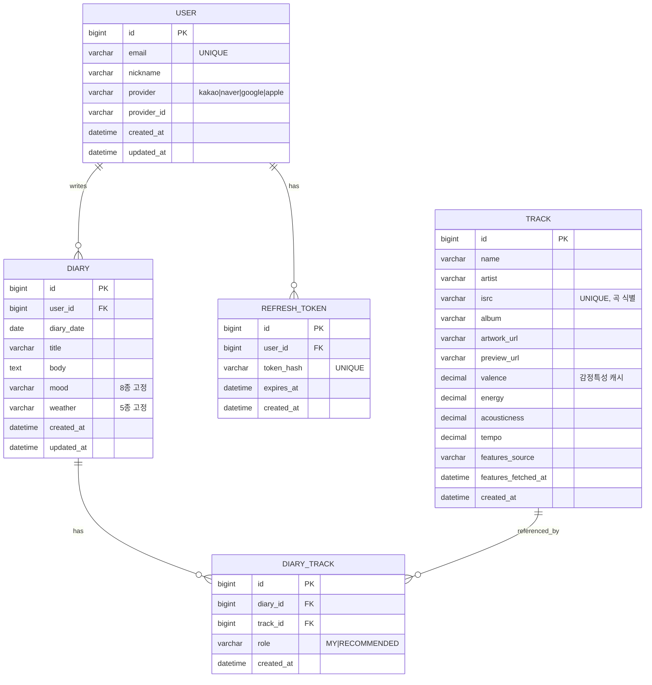

# 뮤징(musing) — ERD

> DB: **MySQL 8 / MariaDB 10.6+ 호환** · 엔진 InnoDB · 문자셋 `utf8mb4`
> 프론트 핸드오프 문서(`FRONTEND_HANDOFF.md`) §3·§6 기준.

## 관계 요약

- `USER` 1 : N `DIARY` — 한 사용자가 여러 일기를 씀
- `USER` 1 : N `REFRESH_TOKEN` — 기기별 로그인 세션(로그아웃·무효화용)
- `DIARY` 1 : N `DIARY_TRACK` — 일기 하나에 "나의 음악(MY)" + "오늘의 추천(RECOMMENDED)" 최대 2건
- `TRACK` 1 : N `DIARY_TRACK` — 같은 곡이 여러 일기에서 재사용 가능 (곡 마스터 정규화)

핵심 제약:
- `DIARY (user_id, diary_date)` **UNIQUE** — 하루 한 개의 일기
- `DIARY_TRACK (diary_id, role)` **UNIQUE** — 한 일기에 MY 1개, RECOMMENDED 1개
- `TRACK (name, artist)` **UNIQUE** — 동일 곡 중복 저장 방지(선택)

## 다이어그램

## 고정값(enum) — 프론트 문자열과 반드시 일치

| 컬럼 | 허용값 |
|---|---|
| `diary.mood` | `기쁨` `우울` `슬픔` `화남` `평온` `보통` `답답` `모름` |
| `diary.weather` | `맑음` `흐림` `비` `눈` `바람` |
| `diary_track.role` | `MY` `RECOMMENDED` |
| `user.provider` | `kakao` `naver` `google` `apple` |

> ⚠️ `mood`/`weather`는 추천 태그 매핑의 키(§5)로 그대로 쓰이므로, DB·API·프론트에서 **위 한글 문자열을 그대로** 주고받습니다. JPA에서는 `@Enumerated(EnumType.STRING)` + 한글 매핑 대신, 코드 enum(예: `Mood.JOY("기쁨")`)을 두고 `value`를 저장/직렬화하는 방식을 권장합니다.

## TRACK 컬럼 상세

| 컬럼 | 타입 | 제약 | 설명 |
|---|---|---|---|
| `id` | BIGINT | PK, AUTO_INCREMENT | 곡 식별자 |
| `name` | VARCHAR(255) | NOT NULL | 곡명 |
| `artist` | VARCHAR(255) | NOT NULL | 가수 |
| `isrc` | VARCHAR(15) | UNIQUE, NULL | 국제 표준 녹음 코드 — 곡 식별·중복제거(있을 때 우선) |
| `album` | VARCHAR(255) | NULL | 앨범명 |
| `artwork_url` | VARCHAR(500) | NULL | 앨범 커버(iTunes 600×600) |
| `preview_url` | VARCHAR(500) | NULL | 30초 미리듣기 URL |
| `valence` | DECIMAL(4,3) | NULL | 감정 밝기 0(어두움)~1(밝음) — 추천 랭킹용 캐시 |
| `energy` | DECIMAL(4,3) | NULL | 격렬함 0(차분)~1(격렬) — arousal 근사 |
| `acousticness` | DECIMAL(4,3) | NULL | 어쿠스틱 정도 0~1 |
| `tempo` | DECIMAL(6,2) | NULL | BPM |
| `features_source` | VARCHAR(20) | NULL | 특성 출처 — `reccobeats` / `essentia` / `acousticbrainz` |
| `features_fetched_at` | DATETIME | NULL | 특성 조회·분석 시각 |
| `created_at` | DATETIME | DEFAULT now | 최초 저장 시각 |

- **UNIQUE(isrc)** — ISRC가 있으면 이걸로 정확히 곡 식별·중복 방지(NULL은 다중 허용). **UNIQUE(name, artist)** — ISRC 없는 곡의 폴백 중복 방지.
- `valence`~`features_fetched_at` 는 **감정 특성 캐시**: 외부(ReccoBeats)나 자체 분석(Essentia)에서 한번 얻어 저장 후 재사용 → 재조회·재분석 없음. 값이 `NULL`이면 아직 미분석 상태. 상세는 `RECOMMENDATION.md`.

## 설계 노트

- **Track 정규화 vs 임베드**: 곡을 별도 마스터로 두면 통계(가장 많이 등장한 곡 등)와 중복 제거에 유리. 단순함을 우선한다면 `diary`에 `my_track_*`, `today_track_*` 컬럼으로 임베드하는 대안도 가능(핸드오프 §6). 본 설계는 **정규화안**을 채택.
- **캘린더 조회**(`GET /diaries?month=`)는 `diary.user_id + diary_date` 인덱스로 커버. 앨범 커버는 `DIARY_TRACK(role=MY 우선, 없으면 RECOMMENDED)`의 `track.artwork_url`.
- **TRACK의 감정 특성**(`valence·energy·acousticness·tempo`)은 추천 랭킹용 캐시. 외부(ReccoBeats 등)에서 한번 조회해 저장하고 재사용 → API 호출 절감. 상세는 `RECOMMENDATION.md`.
- **REFRESH_TOKEN**은 리프레시 토큰을 **해시로** 저장(원문 유출 대비). 로그아웃 시 행 삭제, "모든 기기 로그아웃"은 `user_id`로 일괄 삭제. 만료 토큰은 배치로 정리.
- **삭제 정책**: hard delete 채택. 일기/유저 삭제 시 FK `ON DELETE CASCADE`로 하위 정리. (soft delete가 필요하면 `deleted_at DATETIME NULL` 추가.)
- `created_at`/`updated_at`은 `DEFAULT CURRENT_TIMESTAMP` / `ON UPDATE CURRENT_TIMESTAMP`로 DB 레벨 관리 가능.
